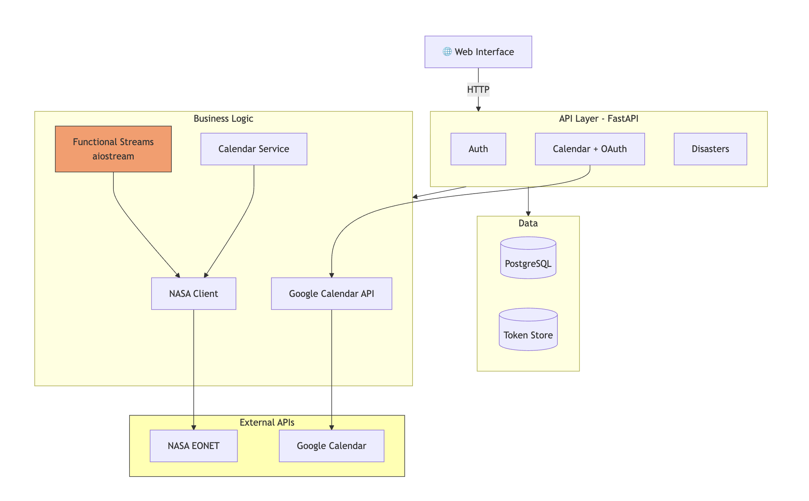

# 🌍 Disaster Tracker

Перед тим як їхати в Дубаї, переконайся що все добре!

## Запуск

### З Docker Compose (рекомендовано)

```bash
docker-compose up --build
```

### Локально

```bash
# Встановити залежності
pip install -r requirements.txt

# Створити .env файл
cp .env.example .env

# Запустити PostgreSQL (або використати Docker)
docker run -d -p 5432:5432 \
  -e POSTGRES_USER=disaster_user \
  -e POSTGRES_PASSWORD=disaster_pass \
  -e POSTGRES_DB=disaster_tracker \
  postgres:15-alpine

# Запустити додаток
python3 -m uvicorn app.main:app --reload
```

Відкрити: `http://localhost:8000`

## Функціонал

✅ **NASA EONET API** — інтеграція з центром сповіщень про катастрофи  
✅ **Real-time API** — отримання подій в реальному часі  
✅ **Google Calendar** — OAuth2 інтеграція, відстеження подій користувача  
✅ **Сповіщення** — попередження про небезпеку біля запланованих подій  
✅ **Hotspots** — найнебезпечніші місця світу з offline геокодингом  
✅ **Аутентифікація** — реєстрація та логін користувачів  
✅ **Функціональне програмування** — Result type (Ok/Err), pattern matching, aiostream, pure functions, reduce

## API Endpoints

### Disasters
```bash
# Всі катастрофи
GET /disasters/events

# По даті
GET /disasters/events/by-date?start_date=2026-04-01&end_date=2026-05-01

# По локації
GET /disasters/events/by-location?lat=50.45&lon=30.52&radius_km=500

# Гарячі точки 
GET /disasters/hotspots?limit=10
```

### Google Calendar
```bash
# OAuth2 логін
GET /calendar/google/oauth/login?user_id=anonymous

# Статус підключення
GET /calendar/google/status?user_id=anonymous

# Отримати події з Google Calendar
GET /calendar/google/events?user_id=anonymous&time_min=2026-03-15&time_max=2026-04-15
```

### Calendar (локальні події)
```bash
# Додати подію
POST /calendar/events
{
  "title": "Подорож до Києва",
  "location": "Kyiv, Ukraine",
  "date": "2026-06-15",
  "user_id": 1
}

# Отримати події
GET /calendar/events?user_id=1
GET /calendar/events?user_id=1&date=2026-06-15

# Перевірити катастрофи біля подій
GET /calendar/check-disasters?user_id=1&start_date=2026-06-01&end_date=2026-06-30

# Відправити сповіщення
POST /calendar/notify-warnings?user_id=1&start_date=2026-06-01&end_date=2026-06-30

# Перевірити чи безпечна локація
GET /calendar/hotspot-warnings?location=Dubai
```

### Auth
```bash
# Реєстрація
POST /auth/register
{
  "email": "user@example.com",
  "password": "password123"
}

# Логін
POST /auth/login
{
  "email": "user@example.com",
  "password": "password123"
}
```

## Архітектура




## Приклад використання

```bash
# Запустити сервер
docker-compose up --build

# Перевірити гарячі точки
curl "http://localhost:8000/disasters/hotspots?limit=10"

# Перевірити чи безпечна локація
curl "http://localhost:8000/calendar/hotspot-warnings?location=Dubai"

# Перевірити катастрофи по даті
curl "http://localhost:8000/disasters/events/by-date?start_date=2026-04-01&end_date=2026-05-01"
```

## Рівні небезпеки

- 🔴 **HIGH**: < 50км — Дуже небезпечно!
- 🟡 **MEDIUM**: 50-100км — Обережно
- 🔵 **LOW**: > 100км — Моніторити

## Ліцензія

MIT
